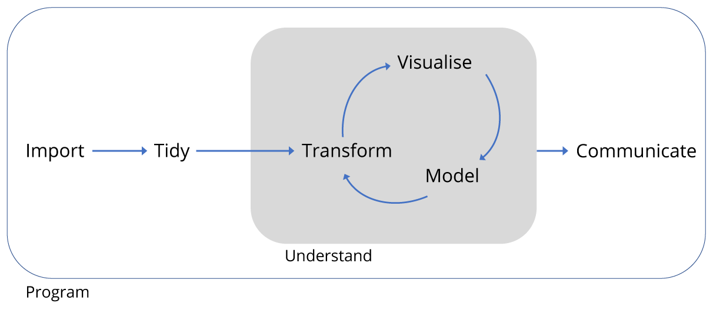

```{r setup, include=FALSE}
knitr::opts_chunk$set(echo = FALSE)
```

## Rectangular data

### We are focused exclusively on data of the type that comes in spreadsheets.

## Tidy data

1. Each observation has its own row.
2. Each variable has its own column.
3. Each value has its own cell.

## Tidying with Open Refine

- Raw data
- Saving data in a "flat" format such as .csv 

## R data types and data frames

 - Doubles: regular numbers, +ve or -ve and with or without decimal places. 
 - Integers: whole numbers
 - Characters: Strings of text
 - Logicals: these store `TRUE` and `FALSE` which are useful for comparisons.
 
 Data frames goup data types as in spreadsheets.

## R objects and functions

- `object_name <- 50`
- `function_name(arg1 = val1, arg2 = val2, ...)`

## {#fullImagePage .flexbox .vcenter .centered}

